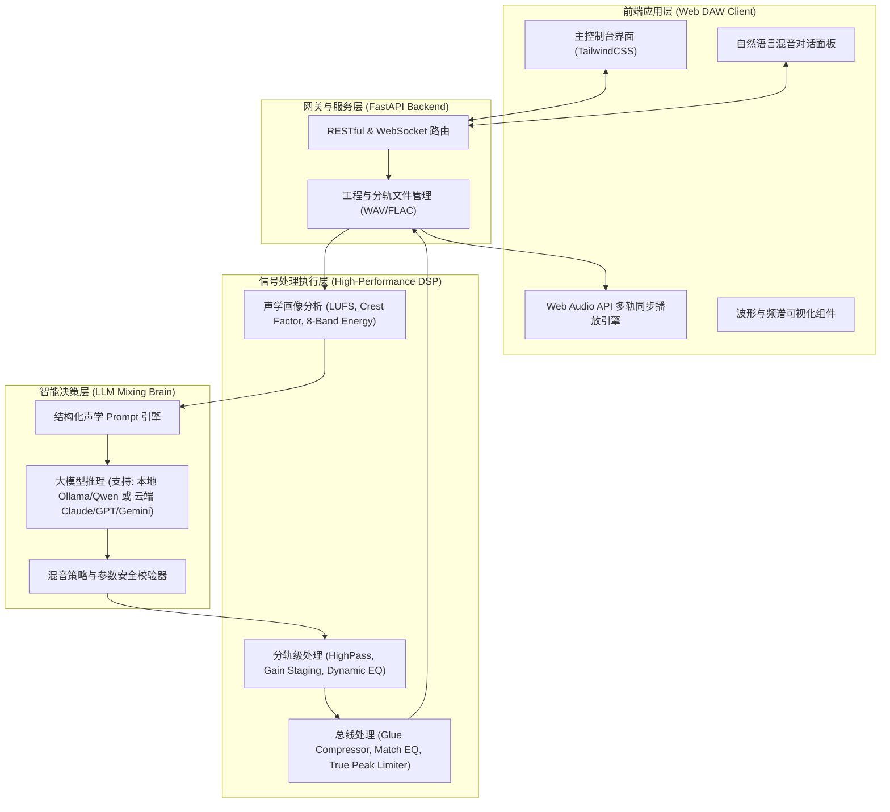

# 智能多轨混音与 AI 音乐工作站 (Smart Mixing & Music AI Studio)
## 总体架构、系统分析与技术规格设计书 (System Specification & Architecture Document)

---

## 1. 产品愿景与系统分析 (System Analysis & Product Vision)

### 1.1 背景与核心痛点
传统数字音频工作站（DAW，如 Logic Pro、Pro Tools、Cubase）对混音有极高的专业声学壁垒，普通创作者或独立音乐人在录音后常常面临：
1. **分轨平衡难**：各轨道频段打架（如底鼓与贝斯低频撞车、人声与键盘中频掩蔽）、动态不稳、相位抵消。
2. **缺乏混音参考标准**：创作者难以将自身作品的音质与流媒体商业母带对齐。
3. **工具过于繁琐**：传统的 EQ、压缩器、侧链阈值、Attack/Release 时间对非专业制作人极其抽象，无法将主观审美需求（如“声音更温暖、更有空气感”）直接映射为技术参数。

### 1.2 系统的革新定位
本项目融合 **现代音频 DSP 信号处理** 与 **大语言模型（LLM）/ 听觉智能决策**，打造新一代 **“人机协作式智能音频工作站”**：
- **物理执行层（DSP Engine）**：保证 100% 极速、无损、低延迟的音频数学运算（无模型幻觉、无串音劣化）。
- **智能决策层（LLM Mixing Copilot）**：担任虚拟资深混音总监，负责参考曲声学解构、专业策略推导、自然语言对话调音。
- **用户交互层（Modern Web DAW）**：提供直观的可视化工作台，支持分轨拖拽、实时 A/B 对比与无损分轨/母带导出。

---

## 2. 三重视角系统分析 (Three Perspectives Analysis)

### 2.1 使用者视角 (User Experience & Interaction Perspective)

```text
[用户界面流转]
  1. 拖入分轨 (录音 WAV/MP3) ──> 2. 上传商业参考曲 (Reference Track)
                                              │
  ┌───────────────────────────────────────────┴──────────────────────────────────────────┐
  ▼                                                                                      ▼
[模式 A: 一键 AI 参考混音]                                             [模式 B: 自然语言对话交互混音]
  • 自动分析参考曲声学画像                                              • 输入："副歌人声不够贴耳，低音有点浑浊"
  • LLM 生成混音师策略方案与诊断报告                                    • LLM 解析意图并调整针对性参数
  • 自动执行多轨 EQ、动态压限与胶水母带                                 • 毫秒级重渲染，即刻试听
  └───────────────────────────────────────────┬──────────────────────────────────────────┘
                                              ▼
                        3. 实时 A/B 盲听对比 (原声 vs 混音版 vs 参考曲)
                                              │
                        4. 导出 (总输出母带 WAV / 处理后纯净各分轨)
```

1. **零门槛导入**：支持多音轨并行拖拽上传（Vocal, Drums, Bass, Piano, Guitar 等），自动识别轨道并绘制波形。
2. **直观控制台**：每轨配备静音（Mute）、独奏（Solo）、音量推子、立体声声相（Pan）以及实时电平表。
3. **混音师对话框（Copilot Chat）**：
   - 可以在输入框以日常口语与 AI 交流（如：“参考曲的声场很开阔，请帮我也把吉他立体声拓宽”、“人声高频稍微暗一点，低频再有弹性一点”）。
   - Copilot 每次调整均会给出简短的专业解释（“已提升 12kHz 空气感 +1.2dB，同时在 250Hz 做窄带衰减以消除浑浊感”）。
4. **一键对比与导出**：一键切换 Original / AI Mix / Reference 三种监听状态，无缝导出 24-bit 48kHz 无损母带及全部分轨。

---

## 2.2 架构视角 (System Architecture & Pipeline)

系统采用 **“前后端分离 + 混合增强分层架构（Hybrid Engine）”**：



---

## 2.3 技术分析视角 (Technical Specification & DSP Details)

#### 1. 结构化声学特征协议 (Acoustic Feature Protocol)
后端提取并结构化成标准化 JSON 数据传输给 LLM：
- **频段能量分布（8 频段）**：
  - Sub-Bass (20 - 60 Hz)
  - Bass (60 - 250 Hz)
  - Low-Mid (250 - 500 Hz)
  - Mid (500 - 2000 Hz)
  - Upper-Mid (2000 - 4000 Hz)
  - Presence (4000 - 6000 Hz)
  - Brilliance (6000 - 12000 Hz)
  - Air (12000 - 20000 Hz)
- **动态与响度指标**：
  - 综合集成响度（Integrated Loudness, LUFS）
  - 响度范围（Loudness Range, LU）
  - 真实峰值（True Peak, dBTP）
  - 峰均比 / 动态波形因数（Crest Factor, dB）
- **立体声场特征**：
  - 声道互相关系数（Stereo Cross-Correlation, -1 ~ +1）
  - 侧向信号能量比（Side/Mid Ratio）

#### 2. LLM 输出规范（可执行的 DSP 参数 Schema）
LLM 输出严格遵循标准化 JSON，确保 DSP 安全执行：
```json
{
  "thought_process": "分析发现原分轨中频 300Hz 处堆积严重，人声发闷；参考曲具有通透的 10kHz 以上空气感...",
  "explanation_for_user": "已清理中低频泥泞感，提升了人声通透度与总体动态冲击力。",
  "track_actions": [
    {
      "track_id": "vocal",
      "high_pass_hz": 90,
      "eq_adjustments": [{"freq": 320, "gain_db": -2.5, "q": 1.2}, {"freq": 8500, "gain_db": 1.8, "q": 0.8}],
      "compressor": {"threshold_db": -18.0, "ratio": 3.0, "attack_ms": 20, "release_ms": 100},
      "pan": 0.0,
      "gain_trim_db": 0.5
    }
  ],
  "bus_master": {
    "glue_compressor": {"threshold_db": -14.0, "ratio": 2.0, "attack_ms": 30, "release_ms": 80},
    "target_lufs": -14.0,
    "ceiling_dbtp": -0.5
  }
}
```

#### 3. DSP 执行链实现
- 使用 **Spotify Pedalboard** + **NumPy / SciPy** 实现全精度 32-bit 浮点流水线。
- 保证无削波（Floating-point Headroom），末端由 ITU-R BS.1770-4 算法配合 True Peak Limiter 做透明防破音压限。
